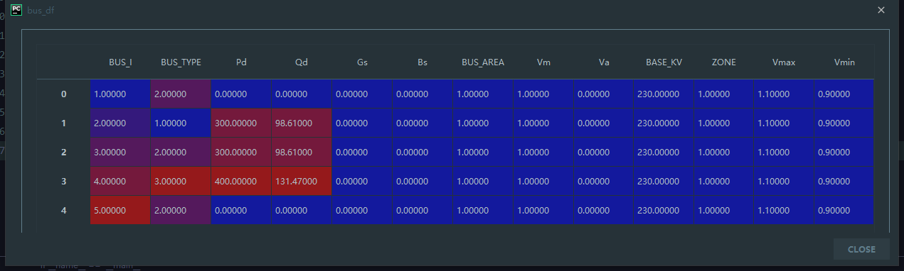
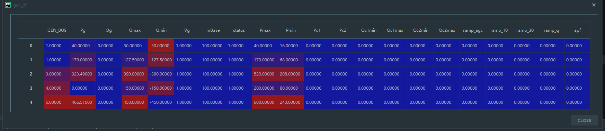
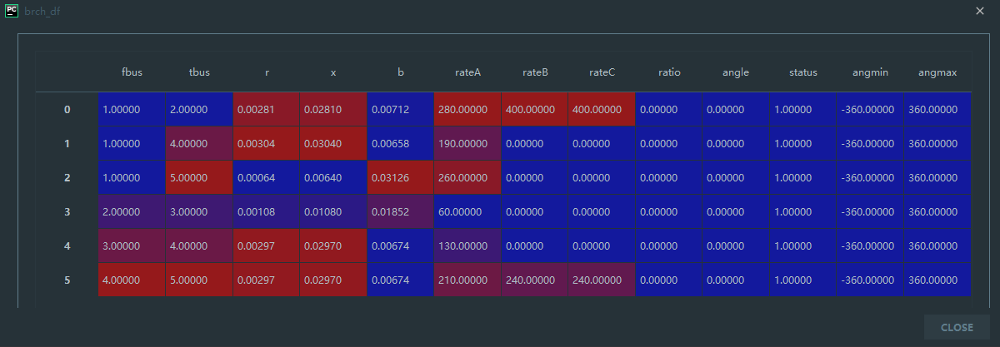
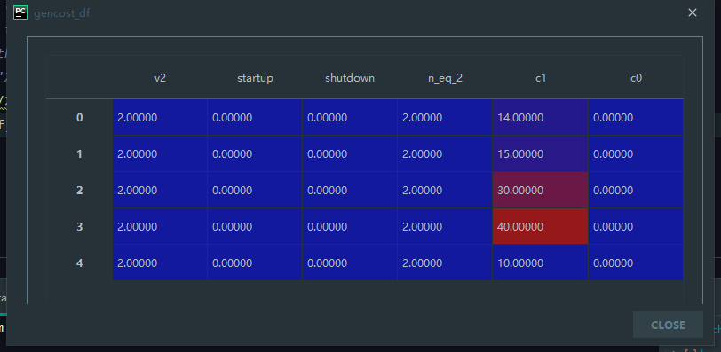
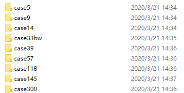
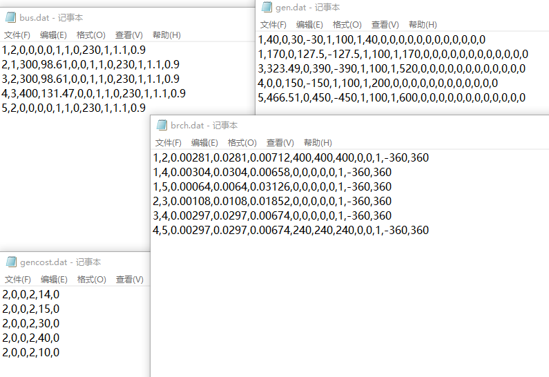

# Transferring Matpower Case File to .csv

> Version: 0.0.1  
> Author: itaoxiaoran  
> E-mail: ta0ran@163.com   

## Contents

- [Introduction](#introduction)

- [Matpower Data File Format](#matpower-data-file-format)

- [File List](#file-list)

- [Code List](#code-list)

- [How to Use the Case File Data](#how-to-use-the-case-file-data)

- [How to Transferring Matpower Case File to .csv by Yourself](#how-to-transferring-matpower-case-file-to-csv-by-yourself)

- [Module Required](#module-required)

## Introduction

Matpower is a package of MATLAB M-files for solving power flow and optimal
power flow problems. It is intended as a simulation tool for researchers and educators
that is easy to use and modify. Matpower is designed to give the best performance
possible while keeping the code simple to understand and modify. The Matpower
website can be found at: [there](http://www.pserc.cornell.edu/matpower/)  

the **Transferring Matpower Case File to .csv** can help you use the Matpower case file in Python

## Matpower Data File Format

1. Bus Data

| Name     | Column | Description                                       |
| -------- | ------ | ------------------------------------------------- |
| BUS_I    | 1      | bus number (positive integer)                     |
| BUS TYPE | 2      | bus type (1 = PQ, 2 = PV, 3 = ref, 4 = isolated)  |
| Pd       | 3      | real power demand (MW)                            |
| Qd       | 4      | reactive power demand (MVAr)                      |
| Gs       | 5      | shunt conductance (MW demanded at V = 1.0 p.u.)   |
| Bs       | 6      | shunt susceptance (MVAr injected at V = 1.0 p.u.) |
| BUS_AREA | 7      | area number (positive integer)                    |
| Vm       | 8      | voltage magnitude (p.u.)                          |
| Va       | 9      | voltage angle (degrees)                           |
| BASE_KV  | 10     | base voltage (kV)                                 |
| ZONE     | 11     | loss zone (positive integer)                      |
| Vmax     | 12     | maximum voltage magnitude (p.u.)                  |
| Vmax     | 13     | minimum voltage magnitude (p.u.)                  |

2. Generator Data

| Name     | Column | Description                                                  |
| -------- | ------ | ------------------------------------------------------------ |
| GEN_BUS  | 1      | bus number                                                   |
| Pg       | 2      | real power output (MW)                                       |
| Qg       | 3      | reactive power output (MVAr)                                 |
| Qmax     | 4      | maximum reactive power output (MVAr)                         |
| Qmin     | 5      | minimum reactive power output (MVAr)                         |
| Vg       | 6      | voltage magnitude setpoint (p.u.)                            |
| mBase    | 7      | total MVA base of machine, defaults to baseMVA               |
| status   | 8      | machine status, > 0 = machine in-service  ,≤ 0 = machine out-of-service |
| Pmax     | 9      | maximum real power output (MW)                               |
| Pmin     | 10     | minimum real power output (MW)                               |
| Pc1      | 11     | lower real power output of PQ capability curve (MW)          |
| Pc2      | 12     | upper real power output of PQ capability curve (MW)          |
| Qc1min   | 13     | minimum reactive power output at PC1 (MVAr)                  |
| Qc1max   | 14     | maximum reactive power output at PC1 (MVAr)                  |
| Qc2min   | 15     | minimum reactive power output at PC2 (MVAr)                  |
| Qc2max   | 16     | maximum reactive power output at PC2 (MVAr)                  |
| ramp_agc | 17     | ramp rate for load following/AGC (MW/min)                    |
| ramp_10  | 18     | ramp rate for 10 minute reserves (MW)                        |
| ramp_30  | 19     | ramp rate for 30 minute reserves (MW)                        |
| ramp_q   | 20     | ramp rate for reactive power (2 sec timescale) (MVAr/min)    |
| apf      | 21     | area participation factor                                    |

3. Branch Data

| Name   | Column | Description                                                  |
| ------ | ------ | ------------------------------------------------------------ |
| fbus   | 1      | "from" bus number                                            |
| tbus   | 2      | "to" bus number                                              |
| r      | 3      | resistance (p.u.)                                            |
| x      | 4      | reactance (p.u.)                                             |
| b      | 5      | total line charging susceptance (p.u.)                       |
| rateA  | 6      | MVA rating A (long term rating), set to 0 for unlimited      |
| rateB  | 7      | MVA rating B (short term rating), set to 0 for unlimited     |
| rateC  | 8      | MVA rating C (emergency rating), set to 0 for unlimited      |
| ratio  | 9      | transformer off nominal turns ratio, (taps at "from" bus, impedance at "to" bus, i.e. if $r = x = b = 0$, $tap={|V_i|/|V_j|}$) |
| angle  | 10     | transformer phase shift angle (degrees), positive -> delay   |
| status | 11     | initial branch status, 1 = in-service, 0 = out-of-service    |
| angmin | 12     | minimum angle difference, $\theta_{f}-\theta_{t}$ (degrees)  |
| angmax | 13     | maximum angle difference, $\theta_{f}-\theta_{t}$ (degrees)  |

4. Generator Cost Data

| Name     | Column | Description                                                  |
| -------- | ------ | ------------------------------------------------------------ |
| Model    | 1      | cost model, 1 = piecewise linear, 2 = polynomial (quadratic polynomial, usually) |
| startup  | 2      | startup cost in US dollars                                   |
| shutdown | 3      | shutdown cost in US dollars                                  |
| Ncost    | 4      | number of cost coefficients for polynomial cost function, or number of data points for piecewise linear |
| cost     | 5      | parameters defining total cost function f(p) begin in this column, units of f and p are US dollars/hr and MW (or MVAr), respectively<br>(MODEL = 1) -> $p_{0}, f_{0}, p_{1}, f_{1}, \ldots, p_{n}, f_{n}$ <br/>where $p_{0}<p_{1}<\cdots<p_{n}$ and the cost $f(p)$ is defined by the coordinates $\left(p_{0}, f_{0}\right),\left(p_{1}, f_{1}\right), \ldots,\left(p_{n}, f_{n}\right)$of the end/break-points of the piecewise linear cost.<br>(MODEL = 2) -> $c_{n}, \dots, c_{1}, c_{0}$<br/>$n + 1$ coefficients of $n$-th order polynomial cost, starting with<br/>highest order, where cost is $f(p)=c_{n} p^{n}+\cdots+c_{1} p+c_{0}$ |

## File List

[case5](https://github.com/itaoxiaoran/power-system-optimization/blob/master/Casefile/getDataFram.py)  
 |-- [brch.dat](https://github.com/itaoxiaoran/power-system-optimization/blob/master/Casefile/case5/brch.dat)  
 |-- [bus.dat](https://github.com/itaoxiaoran/power-system-optimization/blob/master/Casefile/case5/bus.dat)  
 |--[gen.dat](https://github.com/itaoxiaoran/power-system-optimization/blob/master/Casefile/case5/gen.dat)  
 |--[gencost.dat](https://github.com/itaoxiaoran/power-system-optimization/blob/master/Casefile/case5/gencost.dat)  
[case9](https://github.com/itaoxiaoran/power-system-optimization/tree/master/Casefile/case9)  
[case14](https://github.com/itaoxiaoran/power-system-optimization/tree/master/Casefile/case14)  
[case33bw](https://github.com/itaoxiaoran/power-system-optimization/tree/master/Casefile/case33bw)  
[case39](https://github.com/itaoxiaoran/power-system-optimization/tree/master/Casefile/case39)  
[case57](https://github.com/itaoxiaoran/power-system-optimization/tree/master/Casefile/case57)  
[case118](https://github.com/itaoxiaoran/power-system-optimization/tree/master/Casefile/case118)  
[case300](https://github.com/itaoxiaoran/power-system-optimization/tree/master/Casefile/case300) (**Note that**: the Matpower case300 data does not numbering **BUS_I** from 1 to 300, so, I renumber it)  

## Code List

[getDataFrame.py](Casefile/getDataFram.py) - a Python Programing

[write2csv.m](https://github.com/itaoxiaoran/power-system-optimization/blob/master/Casefile/write2csv.m) - a MATLAB M-File

## How to Use the Case File Data

First, you should clone [**getDataFrame.py**](https://github.com/itaoxiaoran/power-system-optimization/blob/master/Casefile/getDataFram.py) and the **Case File Data**.

Run with Python Console, and use this code as following:

```python
#filePath = 'X:/.../caseName'
filePath = 'C:/case5/'
bus_df, gen_df, brch_df, gencost_df = getDataFrame(path=filePath)
```

And, you will see the *bus_df*, *gen_df*, *brch_df*, *gencost_df* in your Python Console

- bus_df:



- gen_df:



- brch_df:



- gencost_df:



## How to Transferring Matpower Case File to .csv by Yourself

If you have MATLAB and install Matpower correctly, you can use the write2csv.m MATLAB M-File

If not, Read more details for MATLAB in [this](https://www.mathworks.com/), and download the Matpower in [this](https://matpower.org/).

For example, input as following, and run in MATLAB.

```matlab
str_caseName = 'case30';
filePath = 'C:\Users\Ran Tao\Documents\GitHub\power-system-optimization\Casefile\';
```

You will get the DAT file like this:

 

In any folder, you will get:


The case5 DAT file are :



## Module Required

numpy, pandas, sys

## 

